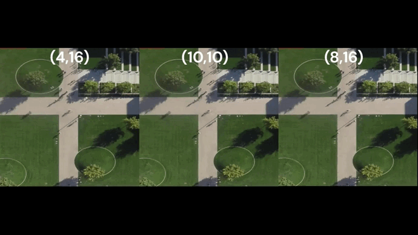

## BEVTracking

### Introduction

This project is based on [PaddleDetection](https://github.com/PaddlePaddle/PaddleDetection). Which use to detect and track the pedestrian in the bird's eye view.


<p align="center">

</p>>

### Data

Standford Drone Dataset (SDD) is used in this project. The dataset can be downloaded from [here](https://cvgl.stanford.edu/projects/uav_data/).

data format:
```
├── SDD
│   ├── annotations
│   │   ├── bookstore
│   │   │   ├── video0
│   │   │   │   ├── annotations.txt
│   │   │   │   ├── reference.jpg
│   │── videos
│   │   ├── bookstore
│   │   │   ├── video0
│   │   │   │   ├── video.mov
```

annotations.txt format:
```
annotations format:
Track ID, xmin, ymin, xmax, ymax, frame, lost, occluded, generated, label
label categories ID map：
Biker：0
Pedestrian：1
Skater：2
Cart：3
Car：4
Bus：5
```
in this project, we only evaluate the performance of pedestrian detection.

there are some mistake in the annotations:
1. some boxes are out of the image
2. in some moment, one object may have two categories, like pedestrian and biker. 
3. some boxes are fake boxes which are not the real objects
4. some boxes look like waiting for the people to come in
5. when people leave the image, the box is still there, it may be common in the mot task, but not in the detection task.

We filter the dataset and remove the above mistakes, also, we add the miss boxes which are not annotated in the original dataset.

shown as below:

<table align="center">
  <tr align="center">
    <td align="center">Ori Dataset annotation</td>
    <td align="center">Filter Dataset annotation</td>
  </tr>
  <tr align="center">
    <td align="center"></td>
    <td align="center"></td>
  </tr>
 </table>

But due to the time limitation, we won't open the filter dataset. If you want to contribute to this project, you can contact me.
the following steps are based on the original dataset.

### Installation

bevtracking requires the following dependencies (tested on Windows 11 and Ubuntu 18.04):

**step.1** install paddle
    
```bash
python -m pip install paddlepaddle-gpu==2.5.2.post116 -f https://www.paddlepaddle.org.cn/whl/windows/mkl/avx/stable.html
```

**step.2** install requirements

```bash
pip install -r requirements.txt
```

### Running

**step.1** download the dataset and put it in the dataset folder

```
├── project
│   ├── dataset
│   │   ├── standford_campus
│   │   │   ├── videos
│   │   │   ├── annotations
```

**step.2** run the following command to prepare the dataset

```bash
python tools/create_data.py
```

**step.3** run the following command to train the model

For single GPU training:
```bash
python tools/train.py -c configs/smalldet/ppyoloe_plus_sod_crn_l_40e_coco.yml --eval --use_vdl True
```
For multi GPU training:
```bash
python -m paddle.distributed.launch --gpus "0,1,2,3,4,5,6,7" tools/train.py -c configs/smalldet/ppyoloe_plus_sod_crn_l_40e_coco.yml --eval --use_vdl True
```
In our config setting, we use 8 GPUs to train the model. If you use less GPUs, please change the learning rate and batch size in the config file.

To visualize the training proces:

```bash
visualdl --logdir vdl_log_dir
```

**step.4** run the following command to eval and Pedestrian Detection

```bash
python tools/eval.py -c configs/smalldet/ppyoloe_plus_sod_crn_l_40e_coco.yml -o weights=output/best_model/model.pdparams
```

To see the visualization results, you can run the following command and check the output folder.

```bash
python tools/vis_det.py --vis_task det --filter_score 0.3 
``` 

**step.5** Export the model

```bash
python tools/export_model.py -c configs/smalldet/ppyoloe_plus_sod_crn_l_40e_coco.yml --output_dir=./inference_model -o weights=output/best_model
``` 

**step.6** Infer Pedestrain Detection

```bash
python deploy/python/infer.py --model_dir=output_inference/ppyoloe_plus_sod_crn_l_40e_coco --image_dir=$image_dir$ --device=GPU --threshold=0.25 --output_dir out_vis --save_results
``` 

**step.7** Infer Pedestrain Prediction

```bash
python tools/infer_mot.py --config=configs/smalldet/ppyoloe_plus_sod_crn_l_track_coco.yml -o weights=output/best_model/model.pdparams --image_dir $image_dir$ --save_images --scaled True --det_results_dir out_vis --output_dir out_mot --given_frame 10 --pred_frame 10
``` 

### TODO LIST 

- [x] Prepare Dataset
- [x] Train and Evaluate Model
- [x] Pedestrian Detection
- [x] Pedestrian Tracking Prediction
- [x] Pedestrian Tracking Prediction analysis
- [ ] Open Filter Dataset


### Citation

```bash
@misc{ppdet2019,
title={PaddleDetection, Object detection and instance segmentation toolkit based on PaddlePaddle.},
author={PaddlePaddle Authors},
howpublished = {\url{https://github.com/PaddlePaddle/PaddleDetection}},
year={2019}
}
```